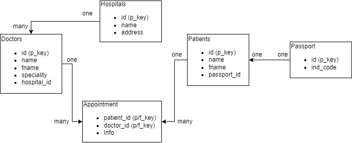
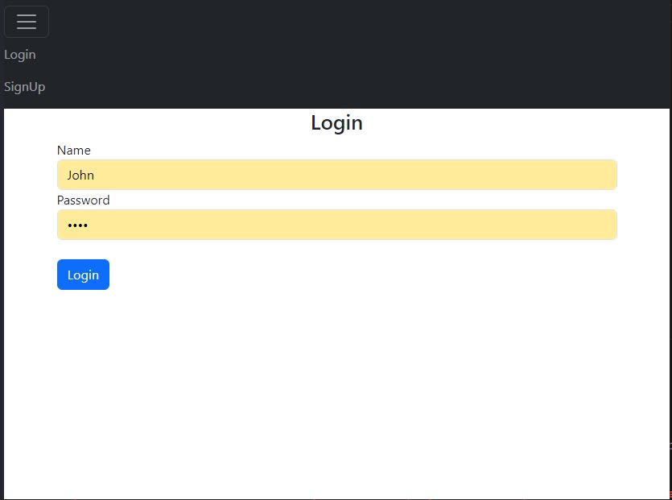
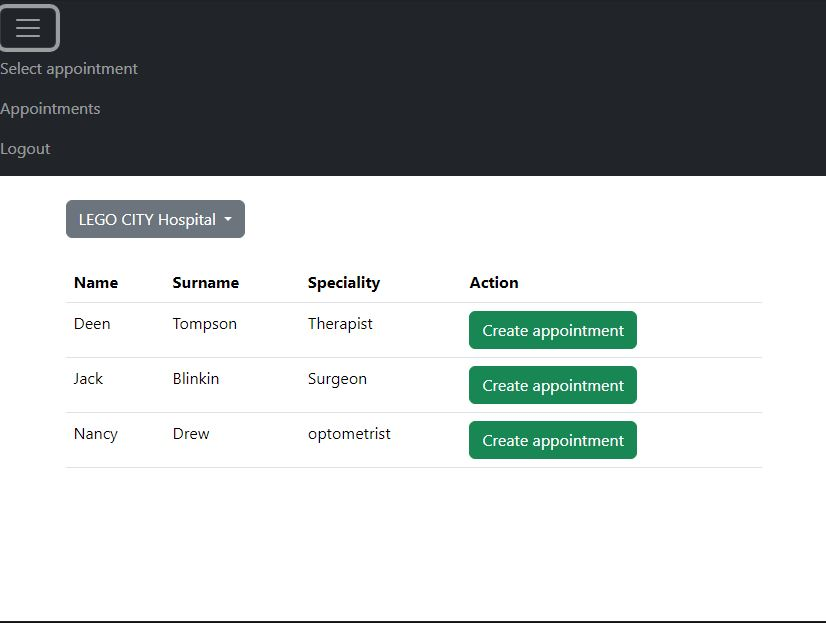
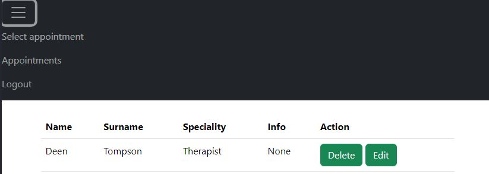

## Тестовое задание
Тема: запись пациентов к врачу.

Архитектура базы данных выглядит следующим образом:

Пациент может зарегистрироваться и зайти на сайт. Если пациент не авторизирован - он не имеет доступа к основному функционалу сайта:

После авторизации становится возможно записаться на прием:

Запись можно отменить или изменить (добавить или поменять доп. информацию) во вкладке Appointments:

## P.S.
* При выборе опр. врача он больше не появляется во вкладке записи на прием, пока запись к нему существует.
* Валидацию особо не делал. Возможны ошибки при регистрации.
* Использовал postgres 16.
